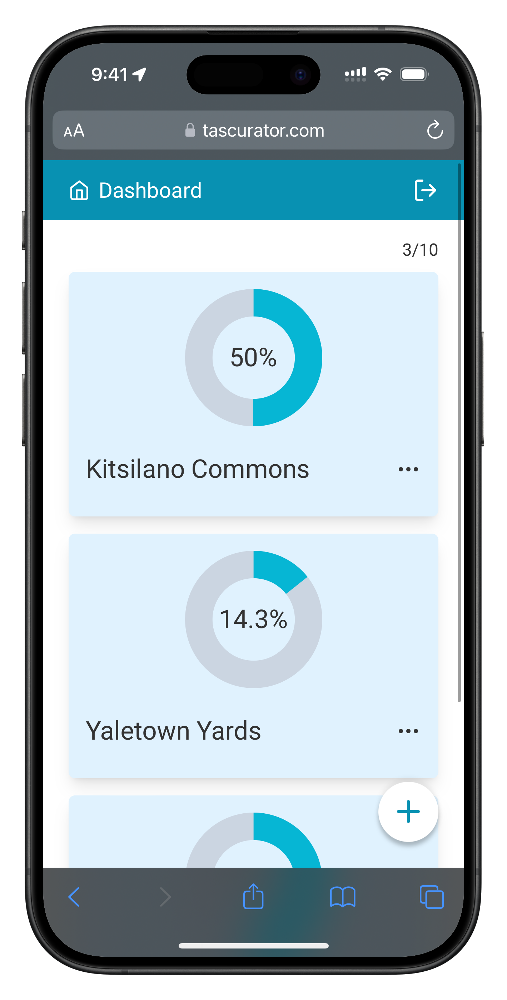
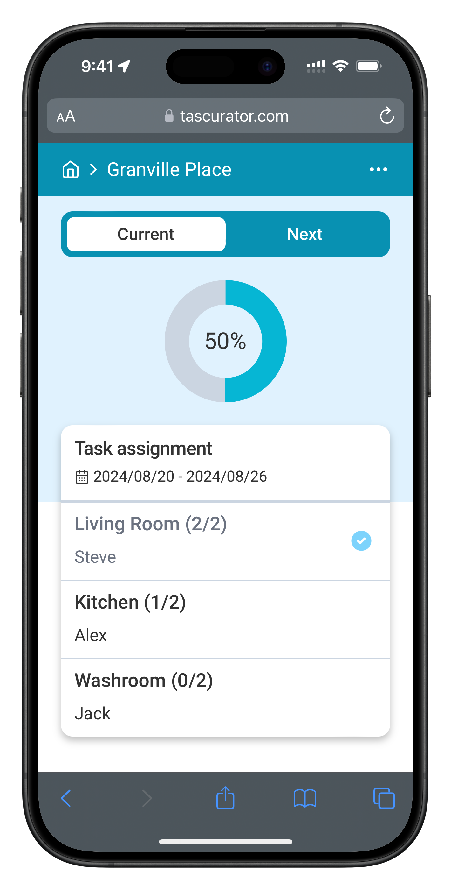
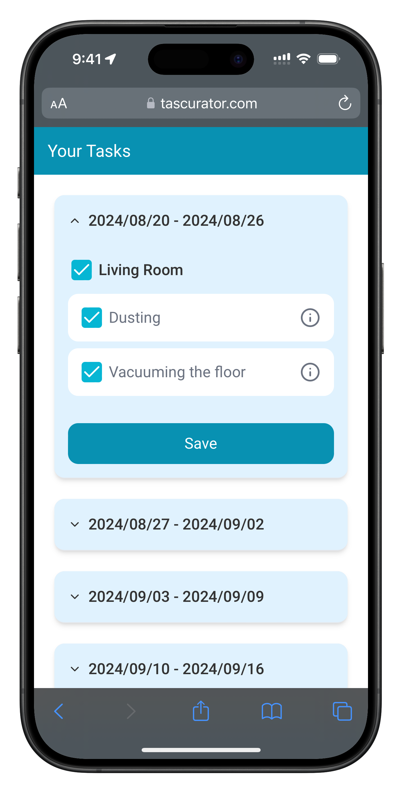
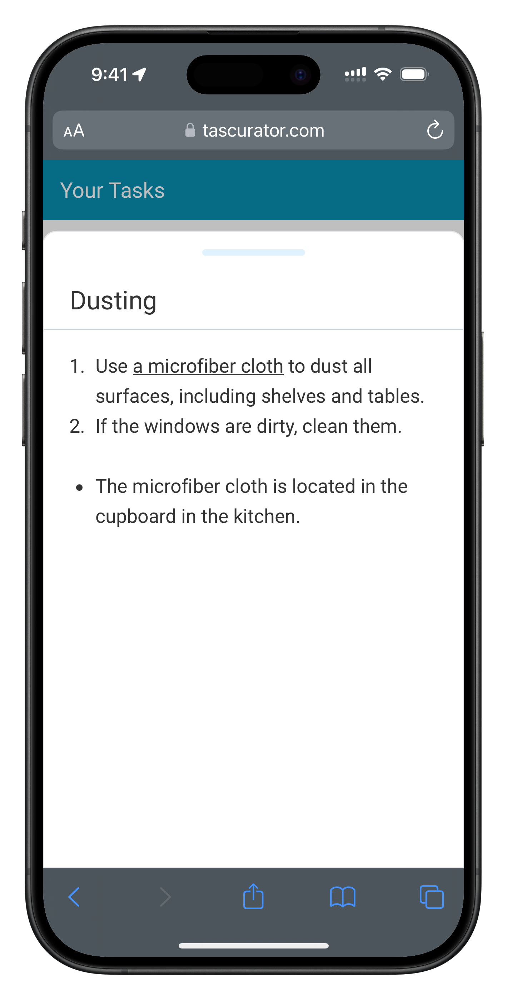

	

 

**Tascurator** is a web application designed to streamline the management of cleaning duties in a shared house.
It offers a user-friendly platform for landlords to effortlessly create tasks with detailed instructions, invite tenants, and track progress.
Tenants can quickly access, update, and report on their tasks, ensuring a well-organized living environment.

  
  
  
  

## Key Features

### For landlords:

- **Task Management**: Create and assign tasks that have detailed instructions, ensuring tenants understand their responsibilities.
- **Task Instructions**: Write detailed instructions or guidelines for each task using Markdown, which tenants can view on their screen. This eliminates the need for landlords to individually explain tasks to tenants.
- **Tenant Management**: Invite tenants to join the shared house and manage their participation via their emails.
- **Progress Tracking**: Monitor the status of each task and tenant at a glance. Landlords with multiple shared houses can view the progress of each house through a centralized dashboard.
- **Rotation Scheduling**: Set how often tasks are rotated among tenants—either every 1 or 2 weeks—to ensure a fair distribution of duties.
- **Automatic Assignments**: Task assignments are automatically updated based on the set rotation schedule, ensuring the workload is regularly distributed without manual intervention.
- **Fair Task Distribution**: The system balances task assignments by considering each tenant’s history, ensuring no tenant is overloaded with extra duties.

### For tenants:

- **Exclusive Access Links**: Access the application via a tenant-exclusive link, with no sign-up required.
- **Task Assignments**: View and update the status of assigned tasks, and report progress directly to the landlord.
- **Task Instructions**: View detailed task instructions provided by the landlord, ensuring tenants understand what is expected.
- **Future Task Previews**: Check upcoming assignments up to three rotations in advance to prepare ahead of time.

## Tech Stack

- **Language**: [TypeScript 5.5](https://devblogs.microsoft.com/typescript/announcing-typescript-5-5/)
- **Frameworks**: [Next.js 14](https://nextjs.org/blog/next-14) (with [App Router](https://nextjs.org/docs/app)), [Hono](https://hono.dev/) (for [Route Handlers](https://nextjs.org/docs/app/building-your-application/routing/route-handlers))
- **Styling**: [Tailwind CSS](https://tailwindcss.com/)
- **Components**: [shadcn/ui](https://ui.shadcn.com/)
- **Form Handling**: [React Hook Form](https://react-hook-form.com/), [zod](https://zod.dev/)
- **Authentication**: [Auth.js](https://authjs.dev/)
- **Database**: [Vercel Postgres](https://vercel.com/docs/storage/vercel-postgres)
- **ORM**: [Prisma](https://www.prisma.io/)
- **Email Services**: [Resend](https://resend.com/), [React Email](https://react.email/)
- **Testing**: [Vitest](https://vitest.dev/)
- **Linting/Formatting**: [ESLint](https://eslint.org/), [Prettier](https://prettier.io/), [Commitlint](https://commitlint.js.org/)
- **Deployment**: [Vercel](https://vercel.com/)

## Getting Started for Developers

Take a look at the [SETUP_GUIDE.md](SETUP_GUIDE.md) for more information on how to set up the project.

## Documentations

### TypeDoc Documentation

The TypeDoc documentation is available at [
https://tascurator.github.io/tascurator-frontend/](https://tascurator.github.io/tascurator-frontend/).

## Authors

- **Akio Osawa** - [@akiomatic](https://github.com/akiomatic)
  - Role: Lead Developer
- **Rina Hara** - [@HrRn](https://github.com/HrRn)
  - Role: Frontend Developer, UI/UX Designer
- **Satomi Nagano** - [@Akikaze1119](https://github.com/Akikaze1119)
  - Role: Frontend Developer
- **Yuki Saito** - [@yuki-92c](https://github.com/yuki-92c)
  - Role: Frontend Developer
- **Kai Koide** - [@KaiKoide](https://github.com/KaiKoide)
  - Role: Backend Developer

## License

Tascurator is open-sourced and licensed under the [MIT License](https://github.com/Tascurator/tascurator-frontend/blob/docs/develop/LICENSE).
